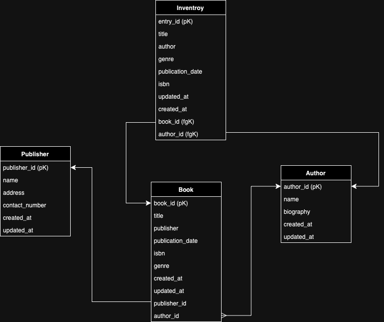

# Backend ApolloGraphQL Server

## Initialize

_Note: .env & .env.docker_psql is required for the backend project as environment variables._

1. Setup PostgreSQL database using Docker

   ```sh
   make docker_psql
   ```

   Then check docker container is running...

   ```sh
    docker ps
   ```

   Should see similar to the following result..

```sh
CONTAINER ID  IMAGE         COMMAND             CREATED      STATUS           PORTS             NAMES
9a86978cecc8 postgres "docker-entrypoint.s…" 3 minutes ago Up 3 minutes 0.0.0.0:5432->5432/tcp sdb_psql
```

## DB Schema


